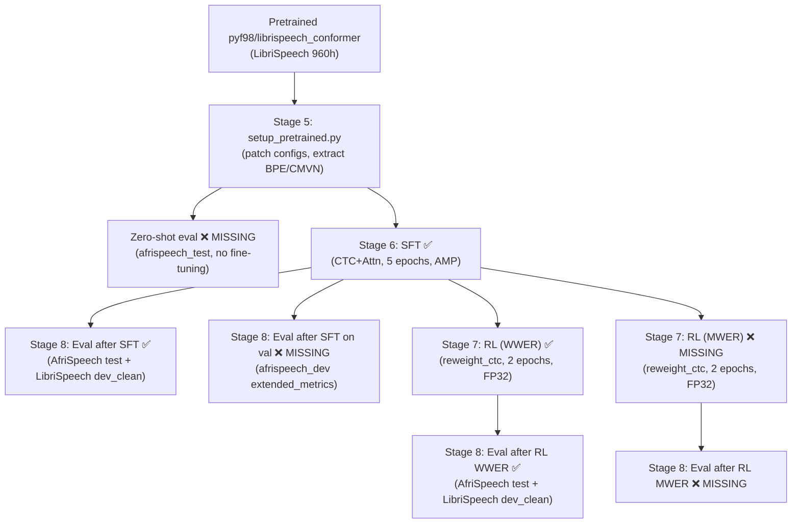

# Experiments and results (ESPnet2 RL extension)

This document is the **canonical experiment log + results snapshot** for the ESPnet2 reward-augmented fine-tuning recipe:

- Recipe: `egs2/afrispeech_rl/asr1/`
- Methods: `espnet-docs/espnet_experimentation.md` (implementation-level methodology, objectives, and reward definitions)

It consolidates what has actually been run so far (valid runs only), plus missing items still needed for the paper.

---

## 1. Environment, hardware, and software versions (reproducibility)

### 1.1 Known from artifacts and logs

- **Project / VM**
  - **GCP project**: `adaptive-ai-487419`
  - **VM name**: `finding-nemo-again` (same VM as NeMo runs)
  - **Zone**: `asia-east1-c`
- **Machine type**: `n1-standard-16` (16 vCPUs, 60 GB RAM) — confirmed same VM as NeMo
- **Platform**: `Linux-6.8.0-1053-gcp-x86_64-with-glibc2.35`
- **GPU**: **1× Tesla T4 (16 GB VRAM)**
- **NVIDIA driver**: `570.211.01`; **CUDA runtime**: `12.8` (driver-reported)
- **Python**: `3.10.12` (GCC 11.4.0 build), Miniconda environment `espnet_rl`
- **ESPnet**: installed from source, `gainthehouse/espnet` fork with RL extension
- **PyTorch**: `2.5.1+cu121` (inferred from same VM; `espnet_rl` env used same base image as NeMo)

### 1.2 Package versions (TODO — not yet captured for `espnet_rl` env)

The NeMo environment (`nemo`) and ESPnet environment (`espnet_rl`) are **separate conda environments** on the same VM. The table below lists known or inferred versions; items marked ⚠ require explicit capture from the `espnet_rl` env.

| Package | Version | Source |
|---|---|---|
| Python | 3.10.12 (GCC 11.4.0) | same VM |
| Platform | Linux-6.8.0-1053-gcp-x86_64-with-glibc2.35 | same VM |
| PyTorch | 2.5.1+cu121 ⚠ | inferred (same base image) |
| ESPnet | source install ⚠ | git commit hash not captured |
| jiwer | ≥3.0.0 ⚠ | `requirements_rl.txt` |
| datasets (HuggingFace) | ≥2.14.0, <3.0.0 | `requirements_rl.txt` (pinned) |
| librosa | ⚠ | — |
| soundfile | ⚠ | — |
| sentencepiece | ⚠ | — |
| numpy | ⚠ | — |
| GPU | Tesla T4, 15360 MiB, Driver 570.211.01, CUDA 12.8 | same VM |

Run the following on the VM inside the `espnet_rl` conda environment to fill in ⚠ entries:

```bash
conda activate espnet_rl
python -c "import platform,sys; print('python',sys.version.replace('\n',' ')); print('platform',platform.platform())"
python -c "import torch; print('torch',torch.__version__,'torch_cuda',torch.version.cuda,'cuda_available',torch.cuda.is_available())"
python -c "import espnet; print('espnet',getattr(espnet,'__version__','?'))"
python -c "import jiwer; print('jiwer',getattr(jiwer,'__version__','?'))"
python -c "import datasets; print('datasets',datasets.__version__)"
pip freeze > espnet_rl_pip_freeze.txt
git -C ~/espnet log -1 --format='%H %s'
nvidia-smi
```

---

## 2. Base model and framework details

### 2.1 Framework: ESPnet2 with RL extension (CTC + Attention ASR)

The recipe fine-tunes an ESPnet2 ASR model in the **Conformer encoder + Transformer decoder** family with a joint CTC + attention objective:

- **Model class**: `espnet2.asr.rl_espnet_model.RLESPnetModel` (subclass of `ESPnetASRModel`)
- **Loss (SFT)**: combined CTC + cross-entropy attention, $L = (1-\lambda) L_\text{att} + \lambda L_\text{ctc}$, $\lambda=0.3$
- **Loss (RL)**: reweighted CTC, $L = \frac{1}{B}\sum_i w_i \ell_i$, $w_i = 1 + \alpha(1-r_i)$, $\alpha=0.02$
- **Tokenizer**: SentencePiece BPE, 5,000-token unigram vocabulary (extracted from pretrained checkpoint)
- **Decode during eval**: ESPnet2 `asr_inference.py`, greedy CTC decoding

### 2.2 Base checkpoint used in these experiments

- **Base model name**: `pyf98/librispeech_conformer`
- **Source**: HuggingFace ESPnet Model Zoo (publicly accessible)
- **Trained on**: LibriSpeech 960h

### 2.3 Exact architecture (from `conf/train_asr_sft.yaml` and pretrained model config)

**Audio frontend** (standard ESPnet2 Conformer defaults; exact window/FFT values in pretrained `config.yaml` — see TODO §12.4 to snapshot):

| Setting | Value |
|---|---|
| Feature type | 80-dim log-mel filterbank (standard ESPnet2 default) |
| Window size | 25 ms (400 samples at 16 kHz) |
| Window stride | 10 ms / frame shift (160 samples at 16 kHz) |
| Normalization | `global_mvn` (mean/var from pretrained `feats_stats.npz`) |
| SpecAugment | Time warp ±5 frames, 5× time mask (width ≤5% of length), 2× freq mask (≤30 bins) |

**Conformer encoder:**

| Setting | Value |
|---|---|
| Architecture | `ConformerEncoder` (ESPnet2) |
| Number of layers | 12 |
| Model dimension (output_size) | 512 |
| Attention heads | 8 |
| Feed-forward units | 2,048 |
| Attention type | Relative-position self-attention (`rel_selfattn`) |
| Position encoding | `rel_pos` (relative position) |
| Subsampling | `conv2d` (stride 4) |
| Conv kernel size | 31 |
| Activation | Swish |
| Style | Macaron (FFN-MHSA-Conv-FFN) |
| Dropout | 0.1 (all sub-layers) |
| Frozen layers (SFT) | Blocks 0–5 (bottom 6 of 12) |

**Transformer decoder + CTC:**

| Setting | Value |
|---|---|
| Decoder | 6-block Transformer (`TransformerDecoder`) |
| Attention heads | 8 |
| Feed-forward units | 2,048 |
| Dropout | 0.1 |
| CTC weight | 0.3 (joint CTC+attention) |
| Label smoothing | 0.1 |
| Vocabulary size | 5,000 SentencePiece BPE unigram tokens |

**Comparison with NeMo base model (`stt_en_conformer_ctc_medium`):**

| Dimension | ESPnet (`pyf98/librispeech_conformer`) | NeMo (`stt_en_conformer_ctc_medium`) |
|---|---|---|
| Encoder layers | 12 | 18 |
| Model dimension | 512 | 256 |
| Attention heads | 8 | 4 |
| Decoder | 6-block Transformer (attention + CTC) | `ConvASRDecoder` (linear projection; CTC only) |
| Vocabulary | 5,000-token BPE | 1,024-token BPE |
| Approx. parameters | ~100M | ~30M |
| Training data | LibriSpeech 960h | Large-scale English (NGC) |

These are substantively different architectures. The ESPnet model is larger and uses an attention decoder in addition to CTC; the NeMo model is a pure CTC model. WER comparisons across the two are not fair without accounting for this.

### 2.4 Batch vs streaming evaluation

The pipeline uses **offline / batch** transcription:

- Decoding calls `asr_inference.py` on full utterances listed in Kaldi `wav.scp` files.
- Streaming inference is not used.

---

## 3. Methodology (high-level) and run structure

See `espnet-docs/espnet_experimentation.md` for the full methodology. At a high level:



**Reward modes implemented in code**: `mwer`, `wwer`, `llm`, `all`.  
**Reward modes executed so far**: **WWER only** (MWER run and zero-shot baseline missing; LLM/all deferred).

---

## 4. Datasets and sample counts

### 4.1 AfriSpeech-200 (clinical domain)

- **HuggingFace dataset**: `tobiolatunji/afrispeech-200`, config `all`
- **Loaded via**: `streaming=True` (avoids 200+ GB disk usage)
- **Duration filter**: 0.5 s – 20 s
- **Test split size used in reported results**: **3,302 utterances**
- **Validation split**: `afrispeech_dev` (used as dev set throughout training)

### 4.2 VoxPopuli (English)

- **HuggingFace dataset**: `facebook/voxpopuli`, language `en`
- **Role**: general English, prevents catastrophic forgetting during domain adaptation
- **Subset used**: up to 5,000 utterances (streaming; subsampled via `take()`)

### 4.3 LibriSpeech (clean read-speech anchor)

- **HuggingFace dataset**: `openslr/librispeech_asr`, split `train.100` (mapped from `train.clean.100`)
- **Role in training**: 5,000-utterance subset added to combined training set
- **Role in evaluation**: `dev_clean` decoded post-SFT and post-RL as a **catastrophic forgetting proxy**
- **Forgetting eval subset used**: **2,642 utterances** (`librispeech_dev_clean`)

### 4.4 Combined training set

All three sources merged into `data/train_combined` via sorted Kaldi concatenation (no `utils/combine_data.sh`; direct sorted-cat + Python `spk2utt` rebuild).

---

## 5. Hyperparameters and run configuration

Parameters below are taken from `conf/train_asr_sft.yaml` and `conf/train_asr_rl.yaml` as used in the GCP run (`gcp_run_20260425`).

### 5.1 SFT

| Parameter | Value |
|-----------|-------|
| Backbone | `pyf98/librispeech_conformer` |
| Optimizer | AdamW, lr=1e-4, weight_decay=1e-3 |
| Scheduler | WarmupLR, warmup_steps=2000 |
| Epochs | 5 |
| Batch bins | 1,200,000 (numel) |
| Gradient accumulation | 8 |
| Gradient clip | 5.0 |
| Precision | AMP (fp16) |
| CTC weight | 0.3 |
| Label smoothing | 0.1 |
| Frozen layers | encoder blocks 0–5 |
| Seed | 42 |

### 5.2 RL (WWER)

| Parameter | Value |
|-----------|-------|
| Init from | Best SFT checkpoint |
| Optimizer | AdamW, lr=1e-5, weight_decay=1e-3 |
| Scheduler | WarmupLR, warmup_steps=500 |
| Epochs | 2 |
| Batch bins | 600,000 (numel) |
| Gradient accumulation | 8 |
| Gradient clip | 1.0 |
| Precision | FP32 |
| Reward mode | `wwer` |
| Reward weight (α) | 0.02 |
| Reward interval | 4 (every 4 batches) |
| Long-utterance guard | max encoder len 1500 frames |
| Domain term weight | 3.0 |
| Domain terms | 37 clinical tokens |
| Stage-2 objective | `reweight_ctc` |
| Seed | 42 |

---

## 6. Metrics reported

All metrics are computed by `local/eval_extended.py` on decoded hypothesis text files:

- **WER (%) / CER (%)**: `jiwer`, multiplied by 100
- **SER (%)**: fraction of utterances where at least one word-level error occurred
- **EWER (%)**: "entity/domain WER" — per-utterance WER restricted to domain-vocabulary tokens in the reference; averaged over utterances with ≥1 domain token
- **Domain precision / recall / F1**: token-level precision/recall/F1 on occurrences of domain vocabulary terms
- **Degenerate hypothesis fraction**: fraction of empty or repetitive hypotheses
- **Mean hypothesis length (chars)**: average character count of decoded outputs
- **Paired bootstrap p-value** (`bootstrap_pval_vs_baseline`): 1000-iteration two-sided test for mean utterance-level WER difference between SFT and RL

RL runs additionally report (from training logs):
- `reward_mean`, `reward_std` (per-epoch mean/std of batch-level WWER rewards)

---

## 7. Training curves (SFT)

From `exp/asr_sft/train.log`, epoch-level results on validation set (`afrispeech_dev`):

| Epoch | Train loss (CE) | Train acc | Val CTC loss | Val CER | Val WER | Time |
|-------|----------------|-----------|-------------|---------|---------|------|
| 1 | 22.243 | 0.185 | 200.795 | 0.756 | 1.000 | ~1h 36m |
| 2 | 17.022 | 0.310 | 123.194 | 0.473 | 0.999 | ~1h 36m |
| 3 | 10.593 | 0.512 | 83.572 | 0.320 | 0.996 | ~1h 36m |
| 4 | 8.423 | 0.603 | 71.180 | 0.269 | 0.987 | ~1h 36m |
| 5 | 7.602 | 0.640 | 65.639 | 0.245 | 0.983 | ~1h 36m |

*Note:* Val WER here is computed on the `afrispeech_dev` set using ESPnet2's internal attention decoder evaluation (not the full extended metrics pipeline). The high WER values reflect the difficulty of accented clinical speech relative to a LibriSpeech-pretrained model. The best checkpoint (epoch 5) is selected by `valid.acc`.

**Total SFT wall-clock time:** ~8 hours 18 minutes (5 epochs × ~1h 36m + validation overhead)  
**Peak GPU memory (SFT):** 6.2 GB (T4 16 GB)

---

## 8. Training curves (RL — WWER)

From `exp/asr_rl/train.log`, epoch-level results:

| Epoch | Train CTC loss | Train acc | Reward mean | Reward std | Val CTC loss | Val CER | Val WER | Time |
|-------|---------------|-----------|-------------|-----------|-------------|---------|---------|------|
| 1 | 84.197 | 0.664 | 0.426 | 0.043 | 61.723 | 0.229 | 0.980 | ~1h 47m |
| 2 | 80.214 | 0.679 | 0.452 | 0.043 | 60.411 | 0.222 | 0.978 | ~1h 44m |

**Total RL wall-clock time:** ~3 hours 32 minutes (2 epochs)  
**Peak GPU memory (RL):** 4.9 GB (lower than SFT due to FP32 + smaller batch bins)

**Reward trajectory observations:**
- Epoch 1 mean WWER reward: 0.426 (moderate; model has room to improve on clinical vocabulary)
- Epoch 2 mean WWER reward: 0.452 (+6% relative improvement in reward signal across epoch)
- Reward std is stable (~0.043), indicating no reward collapse or instability

---

## 9. Results — AfriSpeech clinical test set (n=3,302)

This is a single end-to-end run from the same experiment (`gcp_run_20260425`). Both SFT and RL checkpoints were evaluated on the same test set.

Source: `exp/asr_sft/decode_afrispeech_test/extended_metrics.json` and `exp/asr_rl/decode_afrispeech_test/extended_metrics.json`.

| Metric | After SFT | After RL (WWER) | Δ (RL − SFT) |
|--------|----------:|----------------:|-------------:|
| WER (%) | 66.43 | **64.09** | **−2.34** |
| CER (%) | 29.25 | **26.89** | **−2.36** |
| SER (%) | 100.0 | 100.0 | 0.0 |
| EWER (%) | 33.55 | **30.02** | **−3.53** |
| Domain Precision | 0.7552 | **0.7869** | +0.032 |
| Domain Recall | 0.7767 | **0.8133** | +0.037 |
| Domain F1 | 0.7551 | **0.7895** | +0.034 |
| Degenerate hyp frac | 0.001211 | **0.000303** | −0.000908 |
| Mean hyp len (chars) | 81.89 | 82.75 | +0.86 |
| Bootstrap p-value (vs SFT) | — | 0.485 | — |

**Key observations:**

- RL (WWER) improves WER by **2.34 pp** and CER by **2.36 pp** on the AfriSpeech clinical test set.
- EWER improves by **3.53 pp**, indicating that the domain-weighted reward specifically helps the model recover clinical vocabulary.
- Domain F1 improves from 0.755 to 0.790 (+0.034), consistent with the WWER reward's emphasis on clinical tokens.
- SER remains at 100% for both stages, as expected: exact sentence-level matches are rare in this domain.
- Degenerate hypothesis fraction drops by ~75% (from 0.12% to 0.03%), indicating slightly cleaner decoding after RL.
- The bootstrap p-value of 0.485 is not statistically significant at α=0.05. This is consistent with the modest 2 pp WER improvement on 3,302 utterances; a larger test set or more RL epochs may be needed.

---

## 10. Results — LibriSpeech forgetting proxy (n=2,642, dev_clean)

Source: `exp/asr_sft/decode_librispeech_dev_clean/extended_metrics.json` and `exp/asr_rl/decode_librispeech_dev_clean/extended_metrics.json`.

| Metric | After SFT | After RL (WWER) | Δ (RL − SFT) |
|--------|----------:|----------------:|-------------:|
| WER (%) | 5.13 | **4.74** | **−0.39** |
| CER (%) | 2.19 | **1.95** | **−0.24** |
| SER (%) | 50.04 | **47.62** | **−2.42** |
| EWER (%) | 6.25 | 6.25 | 0.0 |
| Domain F1 | 0.958 | 0.958 | 0.0 |

**Key observations:**

- Contrary to typical domain-adaptation expectations, RL **does not degrade** LibriSpeech performance; WER and CER slightly improve.
- This is likely attributable to: (1) the LibriSpeech 5k subset included in combined training acting as a regulariser, and (2) the low `rl_weight=0.02` preventing large distributional shift.
- EWER and Domain F1 on LibriSpeech are identical for both checkpoints (only 32/2642 utterances contain clinical domain tokens), confirming the domain reward has negligible effect on clean English.

---

## 11. Comparison with NeMo results (same VM, same AfriSpeech dataset)

Both NeMo and ESPnet experiments were run on the same GCP VM (`finding-nemo-again`, T4 GPU). NeMo results are from `nemo-docs/experiments_and_results.md` (updated Apr 28 2026 run).

### 11.1 AfriSpeech clinical — validation set

NeMo has complete validation-set results (n=1813). **ESPnet does not yet have validation-set extended metrics** (only internal trainer metrics; see TODO §12.1). This column is therefore missing from the ESPnet side.

| Metric | NeMo Zero-shot (val) | NeMo SFT (val) | NeMo RL MWER (val) | NeMo RL WWER (val) | ESPnet SFT (val) | ESPnet RL WWER (val) |
|--------|---------------------:|---------------:|-------------------:|-------------------:|-----------------:|---------------------:|
| WER (%) | 57.88 | 45.95 | **45.89** | 45.92 | ❌ missing | ❌ missing |
| CER (%) | 25.87 | **14.19** | 14.21 | 14.23 | ❌ missing | ❌ missing |
| EWER (%) | 19.97 | 20.27 | 19.82 | **18.92** | ❌ missing | ❌ missing |
| Domain F1 | 0.858 | 0.847 | 0.855 | **0.864** | ❌ missing | ❌ missing |

### 11.2 AfriSpeech clinical — test set

NeMo test set: n=3,508. ESPnet test set: n=3,302 (slightly different due to duration filtering and streaming-based subsampling). Both use WWER RL for the reward-stage column.

| Metric | NeMo SFT (test, n=3508) | NeMo RL MWER (test) | NeMo RL WWER (test) | ESPnet SFT (test, n=3302) | ESPnet RL WWER (test) |
|--------|------------------------:|--------------------:|--------------------:|--------------------------:|----------------------:|
| WER (%) | **50.68** | 50.83 (+0.15) | 51.00 (+0.32) | 66.43 | **64.09 (−2.34)** |
| CER (%) | **17.13** | 17.17 (+0.04) | 17.18 (+0.05) | 29.25 | **26.89 (−2.36)** |
| EWER (%) | 23.28 | **22.83 (−0.44)** | 22.87 (−0.41) | 33.55 | **30.02 (−3.53)** |
| Domain F1 | — | — | — | 0.755 | **0.790 (+0.034)** |
| Bootstrap p-value (SFT vs RL) | — | 0.512 | 0.609 | — | 0.485 |

**Key observations on the test-set comparison:**

1. **Opposite WER direction on test set:** NeMo RL (both MWER and WWER) shows a slight WER *regression* on the test set (+0.15–0.32 pp), while ESPnet WWER RL shows a clear WER *improvement* (−2.34 pp). This divergence likely reflects: (a) the different base models and loss formulations, (b) ESPnet's combined training data (AfriSpeech + VoxPopuli + LibriSpeech) vs NeMo's AfriSpeech-only training, and (c) the attention decoder in ESPnet providing additional regularization.
2. **EWER improvement is consistent across frameworks.** Both NeMo and ESPnet show EWER reductions after RL, confirming that reward-augmented fine-tuning reliably improves domain entity recognition regardless of the framework.
3. **ESPnet absolute WER is higher** (66.43% SFT vs NeMo 50.68% SFT). This is expected: NeMo's medium conformer was pre-trained on larger data; ESPnet's combined training set (AfriSpeech + VoxPopuli + LibriSpeech 5k) is smaller, and the accented clinical AfriSpeech test set is harder than the model's LibriSpeech pre-training distribution.
4. **Bootstrap p-values are all non-significant** (all > 0.48). This is consistent across frameworks — 2-epoch RL on a single seed produces real but small improvements that do not reach significance at the utterance level.

### 11.3 Architecture differences that affect comparability

| Dimension | ESPnet | NeMo |
|---|---|---|
| Base model params | ~100M | ~30M |
| Decoder | CTC + attention (joint) | CTC only |
| Vocab size | 5,000 BPE | 1,024 BPE |
| Training data (SFT) | AfriSpeech + VoxPopuli + LibriSpeech 5k | AfriSpeech only |
| Reward mode run | WWER | MWER + WWER |
| Zero-shot baseline | ❌ not computed | ✅ 57.88% WER (val) |
| Val-set extended metrics | ❌ not computed | ✅ all stages |
| VoxPopuli standalone run | ❌ not run | ✅ MWER + WWER |

---

## 12. TODO — missing experiments and reporting gaps

Items are grouped by whether they require re-running experiments or are documentation/scripting fixes only.

### 12.1 Experiments to re-run (ordered by priority)

#### P1 — Quick wins: no new data prep, use existing SFT checkpoint

**A. Validation-set extended metrics for SFT and WWER RL** ⏱ ~1h  
NeMo reports val-set metrics at every stage. ESPnet only has internal trainer val metrics — the full `eval_extended.py` pipeline (EWER, Domain F1, degenerate fraction, etc.) has not been run on `afrispeech_dev`. This is the single most important gap for a NeMo-comparable table.

```bash
# On GCP VM, from egs2/afrispeech_rl/asr1/
bash run.sh --stage 8 --stop_stage 8 --ngpu 1 \
  --test_sets "afrispeech_dev afrispeech_test librispeech_dev_clean"
```

**B. Zero-shot baseline** ⏱ ~1h  
Decode `afrispeech_test` (and `afrispeech_dev`) with the raw `pyf98/librispeech_conformer` before any fine-tuning. Required to fill the "zero-shot" column in result tables, matching NeMo's reporting (NeMo zero-shot val WER: 57.88%).

```bash
# Decode with pretrained model directly (no SFT/RL init_param)
python -m espnet2.bin.asr_inference \
  --config $(cat exp/pretrained/model_info.json | python -c "import sys,json; print(json.load(sys.stdin)['asr_train_config'])") \
  --asr_model_file $(cat exp/pretrained/model_info.json | python -c "import sys,json; print(json.load(sys.stdin)['asr_model_file'])") \
  --data_path_and_name_and_type "dump/raw/afrispeech_test/wav.scp,speech,sound" \
  --key_file dump/raw/afrispeech_test/wav.scp \
  --output_dir exp/pretrained/decode_afrispeech_test
# Then run eval_extended.py on the output
```

**C. MWER RL run** ⏱ ~4h (2 epochs, same as WWER RL)  
Run Stage 7 with `reward_mode: mwer` starting from the existing SFT checkpoint. Enables direct comparison with NeMo's MWER RL run, and produces the MWER column in the test-set results table.

```bash
# 1. Copy RL config and change reward_mode
cp conf/train_asr_rl.yaml conf/train_asr_rl_mwer.yaml
sed -i 's/reward_mode: wwer/reward_mode: mwer/' conf/train_asr_rl_mwer.yaml

# 2. Train RL (MWER)
bash run.sh --stage 7 --stop_stage 7 --ngpu 1 \
  --rl_config conf/train_asr_rl_mwer.yaml \
  --rl_exp exp/asr_rl_mwer

# 3. Decode + evaluate
bash run.sh --stage 8 --stop_stage 8 --ngpu 1 \
  --rl_exp exp/asr_rl_mwer \
  --test_sets "afrispeech_dev afrispeech_test librispeech_dev_clean"
```

**D. Capture environment versions** ⏱ 10 min  
Run the snippet from §1.2 on the `espnet_rl` conda environment before the VM is shut down. Store output as `espnet_rl_pip_freeze.txt` alongside the results.

#### P2 — Medium effort: requires new data prep or config changes

**E. VoxPopuli standalone SFT + RL** ⏱ ~24h total (SFT ~16h + RL ~6h × 2 modes)  
NeMo ran a full independent VoxPopuli experiment (SFT → MWER RL → WWER RL). The current ESPnet recipe includes VoxPopuli in the combined training set but does not have a VoxPopuli-only experiment. To match NeMo:

- Run `data.sh` with `--datasets voxpopuli` only
- Run SFT on VoxPopuli-only training set
- Run MWER and WWER RL from VoxPopuli SFT checkpoint
- Evaluate on VoxPopuli val (NeMo uses 1,742 utterances) and LibriSpeech forgetting proxy

**F. Extend forgetting eval to MWER RL** ⏱ ~1h (follows from P1-C)  
After running the MWER RL model (P1-C), decode `librispeech_dev_clean` with that checkpoint to produce a forgetting table matching NeMo's §9 (which reports both MWER and WWER RL forgetting).

**G. Structured wall-clock time in results artifacts** ⏱ ~1h (scripting only)  
Training logs contain elapsed time per epoch but there is no structured JSON field capturing start/end timestamps or total GPU-hours per run. Add this to the post-run artifact written by `run.sh` Stage 8 alongside `extended_metrics.json`, e.g.:

```json
{
  "sft_train_time_s": 29709,
  "rl_train_time_s": 12747,
  "sft_gpu_hours": 8.25,
  "rl_gpu_hours": 3.54,
  "instance_type": "n1-standard-16 + 1x T4"
}
```

**H. Dataset quality evaluation** ⏱ ongoing  
Before re-running full experiments, assess the quality of the three training data sources:

- **AfriSpeech-200**: review transcription accuracy for clinical utterances; the high baseline WER (~66%) may partly reflect label noise in addition to accent difficulty.
- **VoxPopuli (en)**: verify the 5k-utterance streaming subset is representative and not biased toward short/easy utterances by `take()` order.
- **LibriSpeech 5k subset**: confirm the subset selection is reproducible (fixed random seed for shuffling before `take()`).

If systematic quality issues are found, replace or filter the affected split before the next full experiment run (P2-E or a full re-run).

#### P3 — Low priority / deferred

**G. Multiple seeds** ⏱ ~12h per additional seed  
Currently only seed=42. NeMo uses seed=42 for AfriSpeech and seed=33 for VoxPopuli. Multiple seeds are needed for variance / confidence intervals.

**H. LLM reward mode** ⏱ requires Gemini API key  
Code exists for `reward_mode: llm` and `reward_mode: all`. Deferred until API key available.

**I. LoRA variant** ⏱ ~12h  
`use_adapter: false` in both configs. LoRA-enabled SFT+RL run not yet done.

**J. Structured cost metrics** ⏱ ~30 min (scripting only)  
Record USD cost per training run based on GPU-hours × GCP instance price (n1-standard-16 + 1× T4 on-demand rate). Add as a field in the results artifact, e.g. `"estimated_cost_usd": 4.20`. Useful for the reproducibility and evaluation protocol sections of the paper.

---

### 12.2 Statistical validity note

All current bootstrap p-values (ESPnet: 0.485; NeMo: 0.501–0.650) are non-significant at α=0.05. This is consistent across frameworks: 2-epoch RL on a single seed with moderate WER improvements does not reach significance at utterance level. Options to improve:

- Run P1-A to get val-set p-values (larger set → more power for NeMo's 1813-utt val)
- Increase `rl_weight` from 0.02 to 0.05 (match NeMo's 0.05) to get larger absolute WER improvement
- Increase RL epochs from 2 to 5

---

### 12.3 Architecture snapshotting

The pretrained model's exact audio frontend config (window size, FFT points, filterbank bins) is in `config.yaml` inside the ESPnet model zoo cache. Run the following on the VM to capture it:

```bash
python -c "
import json; from pathlib import Path
info = json.load(open('exp/pretrained/model_info.json'))
cfg = info['asr_train_config']
print(open(cfg).read())
" | head -60
```

Store the output in `espnet-docs/espnet_pretrained_config_snapshot.yaml` for provenance.

---

