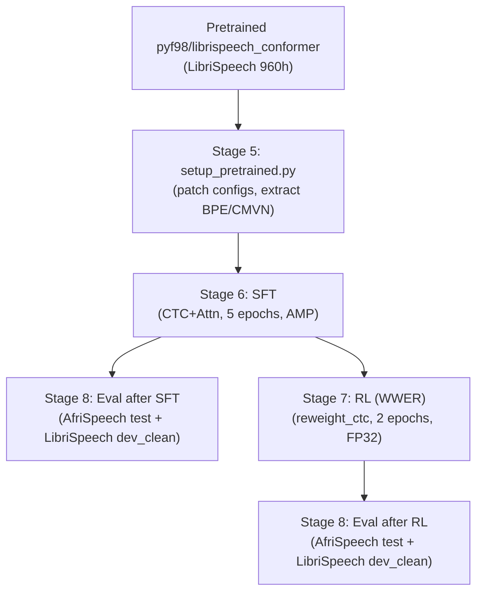

# Experiments and results (ESPnet2 RL extension)

This document is the **canonical experiment log + results snapshot** for the ESPnet2 reward-augmented fine-tuning recipe:

- Recipe: `egs2/afrispeech_rl/asr1/`
- Methods: `espnet-docs/espnet_experimentation.md` (implementation-level methodology, objectives, and reward definitions)

It consolidates what has actually been run so far (valid runs only), plus missing items still needed for the paper.

---

## 1. Environment, hardware, and software versions (reproducibility)

### 1.1 Known from artifacts and logs

- **Project / VM**
  - **GCP project**: `adaptive-ai-487419`
  - **VM name**: `finding-nemo-again` (same VM as NeMo runs)
  - **Zone**: `asia-east1-c`
- **GPU**: **1× Tesla T4 (16 GB)**
- **Python**: `3.10.x` (Miniconda environment `espnet_rl`)
- **ESPnet**: installed from source (`gainthehouse/espnet` branch with RL extension)
- **PyTorch**: CUDA-enabled build (T4 driver CUDA 12.x)
- **Key Python packages**: `espnet`, `espnet_model_zoo`, `jiwer`, `datasets>=2.14.0,<3.0.0`, `soundfile`, `librosa`, `sentencepiece`, `google-generativeai`, `loralib`, `humanfriendly`

### 1.2 Still missing (TODO)

These were not captured into run artifacts and should be recorded manually in future runs:

- Exact PyTorch version (e.g., `torch.__version__`)
- Exact ESPnet version / git commit hash
- Full `pip freeze` output for the `espnet_rl` conda environment
- GCP machine type (beyond GPU model)
- Training wall-clock cost (GPU-hours)

Recommended one-time capture snippet (run on VM inside the `espnet_rl` conda environment):

```bash
python -c "import platform,sys; print('python',sys.version.replace('\n',' ')); print('platform',platform.platform())"
python -c "import torch; print('torch',torch.__version__,'torch_cuda',torch.version.cuda,'cuda_available',torch.cuda.is_available())"
python -c "import espnet; print('espnet',getattr(espnet,'__version__','?'))"
python -c "import jiwer; print('jiwer',getattr(jiwer,'__version__','?'))"
python -c "import datasets; print('datasets',datasets.__version__)"
nvidia-smi
git -C ~/espnet log -1 --format='%H %s'
```

---

## 2. Base model and framework details

### 2.1 Framework: ESPnet2 with RL extension (CTC + Attention ASR)

The recipe fine-tunes an ESPnet2 ASR model in the **Conformer encoder + Transformer decoder** family with a joint CTC + attention objective:

- **Model class**: `espnet2.asr.rl_espnet_model.RLESPnetModel` (subclass of `ESPnetASRModel`)
- **Loss (SFT)**: combined CTC + cross-entropy attention, $L = (1-\lambda) L_\text{att} + \lambda L_\text{ctc}$, $\lambda=0.3$
- **Loss (RL)**: reweighted CTC, $L = \frac{1}{B}\sum_i w_i \ell_i$, $w_i = 1 + \alpha(1-r_i)$, $\alpha=0.02$
- **Tokenizer**: SentencePiece BPE, 5,000-token unigram vocabulary (extracted from pretrained checkpoint)
- **Decode during eval**: ESPnet2 `asr_inference.py`, greedy CTC decoding

### 2.2 Base checkpoint used in these experiments

- **Base model name**: `pyf98/librispeech_conformer`
- **Source**: HuggingFace ESPnet Model Zoo (publicly accessible)
- **Architecture**: 12-block Conformer encoder (`output_size=512`, `attention_heads=8`, `linear_units=2048`), 6-block Transformer decoder, Macaron-style, relative position encoding, CNN module (kernel 31)
- **Parameters**: ~100M (full Conformer-medium scale)
- **Trained on**: LibriSpeech 960h

### 2.3 Batch vs streaming evaluation

The pipeline uses **offline / batch** transcription:

- Decoding calls `asr_inference.py` on full utterances listed in Kaldi `wav.scp` files.
- Streaming inference is not used.

---

## 3. Methodology (high-level) and run structure

See `espnet-docs/espnet_experimentation.md` for the full methodology. At a high level:



**Reward modes implemented in code**: `mwer`, `wwer`, `llm`, `all`.  
**Reward modes executed so far**: **WWER only** (MWER planned next; LLM/all explicitly deferred).

---

## 4. Datasets and sample counts

### 4.1 AfriSpeech-200 (clinical domain)

- **HuggingFace dataset**: `tobiolatunji/afrispeech-200`, config `all`
- **Loaded via**: `streaming=True` (avoids 200+ GB disk usage)
- **Duration filter**: 0.5 s – 20 s
- **Test split size used in reported results**: **3,302 utterances**
- **Validation split**: `afrispeech_dev` (used as dev set throughout training)

### 4.2 VoxPopuli (English)

- **HuggingFace dataset**: `facebook/voxpopuli`, language `en`
- **Role**: general English, prevents catastrophic forgetting during domain adaptation
- **Subset used**: up to 5,000 utterances (streaming; subsampled via `take()`)

### 4.3 LibriSpeech (clean read-speech anchor)

- **HuggingFace dataset**: `openslr/librispeech_asr`, split `train.100` (mapped from `train.clean.100`)
- **Role in training**: 5,000-utterance subset added to combined training set
- **Role in evaluation**: `dev_clean` decoded post-SFT and post-RL as a **catastrophic forgetting proxy**
- **Forgetting eval subset used**: **2,642 utterances** (`librispeech_dev_clean`)

### 4.4 Combined training set

All three sources merged into `data/train_combined` via sorted Kaldi concatenation (no `utils/combine_data.sh`; direct sorted-cat + Python `spk2utt` rebuild).

---

## 5. Hyperparameters and run configuration

Parameters below are taken from `conf/train_asr_sft.yaml` and `conf/train_asr_rl.yaml` as used in the GCP run (`gcp_run_20260425`).

### 5.1 SFT

| Parameter | Value |
|-----------|-------|
| Backbone | `pyf98/librispeech_conformer` |
| Optimizer | AdamW, lr=1e-4, weight_decay=1e-3 |
| Scheduler | WarmupLR, warmup_steps=2000 |
| Epochs | 5 |
| Batch bins | 1,200,000 (numel) |
| Gradient accumulation | 8 |
| Gradient clip | 5.0 |
| Precision | AMP (fp16) |
| CTC weight | 0.3 |
| Label smoothing | 0.1 |
| Frozen layers | encoder blocks 0–5 |
| Seed | 42 |

### 5.2 RL (WWER)

| Parameter | Value |
|-----------|-------|
| Init from | Best SFT checkpoint |
| Optimizer | AdamW, lr=1e-5, weight_decay=1e-3 |
| Scheduler | WarmupLR, warmup_steps=500 |
| Epochs | 2 |
| Batch bins | 600,000 (numel) |
| Gradient accumulation | 8 |
| Gradient clip | 1.0 |
| Precision | FP32 |
| Reward mode | `wwer` |
| Reward weight (α) | 0.02 |
| Reward interval | 4 (every 4 batches) |
| Long-utterance guard | max encoder len 1500 frames |
| Domain term weight | 3.0 |
| Domain terms | 37 clinical tokens |
| Stage-2 objective | `reweight_ctc` |
| Seed | 42 |

---

## 6. Metrics reported

All metrics are computed by `local/eval_extended.py` on decoded hypothesis text files:

- **WER (%) / CER (%)**: `jiwer`, multiplied by 100
- **SER (%)**: fraction of utterances where at least one word-level error occurred
- **EWER (%)**: "entity/domain WER" — per-utterance WER restricted to domain-vocabulary tokens in the reference; averaged over utterances with ≥1 domain token
- **Domain precision / recall / F1**: token-level precision/recall/F1 on occurrences of domain vocabulary terms
- **Degenerate hypothesis fraction**: fraction of empty or repetitive hypotheses
- **Mean hypothesis length (chars)**: average character count of decoded outputs
- **Paired bootstrap p-value** (`bootstrap_pval_vs_baseline`): 1000-iteration two-sided test for mean utterance-level WER difference between SFT and RL

RL runs additionally report (from training logs):
- `reward_mean`, `reward_std` (per-epoch mean/std of batch-level WWER rewards)

---

## 7. Training curves (SFT)

From `exp/asr_sft/train.log`, epoch-level results on validation set (`afrispeech_dev`):

| Epoch | Train loss (CE) | Train acc | Val CTC loss | Val CER | Val WER | Time |
|-------|----------------|-----------|-------------|---------|---------|------|
| 1 | 22.243 | 0.185 | 200.795 | 0.756 | 1.000 | ~1h 36m |
| 2 | 17.022 | 0.310 | 123.194 | 0.473 | 0.999 | ~1h 36m |
| 3 | 10.593 | 0.512 | 83.572 | 0.320 | 0.996 | ~1h 36m |
| 4 | 8.423 | 0.603 | 71.180 | 0.269 | 0.987 | ~1h 36m |
| 5 | 7.602 | 0.640 | 65.639 | 0.245 | 0.983 | ~1h 36m |

*Note:* Val WER here is computed on the `afrispeech_dev` set using ESPnet2's internal attention decoder evaluation (not the full extended metrics pipeline). The high WER values reflect the difficulty of accented clinical speech relative to a LibriSpeech-pretrained model. The best checkpoint (epoch 5) is selected by `valid.acc`.

**Total SFT wall-clock time:** ~8 hours 18 minutes (5 epochs × ~1h 36m + validation overhead)  
**Peak GPU memory (SFT):** 6.2 GB (T4 16 GB)

---

## 8. Training curves (RL — WWER)

From `exp/asr_rl/train.log`, epoch-level results:

| Epoch | Train CTC loss | Train acc | Reward mean | Reward std | Val CTC loss | Val CER | Val WER | Time |
|-------|---------------|-----------|-------------|-----------|-------------|---------|---------|------|
| 1 | 84.197 | 0.664 | 0.426 | 0.043 | 61.723 | 0.229 | 0.980 | ~1h 47m |
| 2 | 80.214 | 0.679 | 0.452 | 0.043 | 60.411 | 0.222 | 0.978 | ~1h 44m |

**Total RL wall-clock time:** ~3 hours 32 minutes (2 epochs)  
**Peak GPU memory (RL):** 4.9 GB (lower than SFT due to FP32 + smaller batch bins)

**Reward trajectory observations:**
- Epoch 1 mean WWER reward: 0.426 (moderate; model has room to improve on clinical vocabulary)
- Epoch 2 mean WWER reward: 0.452 (+6% relative improvement in reward signal across epoch)
- Reward std is stable (~0.043), indicating no reward collapse or instability

---

## 9. Results — AfriSpeech clinical test set (n=3,302)

This is a single end-to-end run from the same experiment (`gcp_run_20260425`). Both SFT and RL checkpoints were evaluated on the same test set.

Source: `exp/asr_sft/decode_afrispeech_test/extended_metrics.json` and `exp/asr_rl/decode_afrispeech_test/extended_metrics.json`.

| Metric | After SFT | After RL (WWER) | Δ (RL − SFT) |
|--------|----------:|----------------:|-------------:|
| WER (%) | 66.43 | **64.09** | **−2.34** |
| CER (%) | 29.25 | **26.89** | **−2.36** |
| SER (%) | 100.0 | 100.0 | 0.0 |
| EWER (%) | 33.55 | **30.02** | **−3.53** |
| Domain Precision | 0.7552 | **0.7869** | +0.032 |
| Domain Recall | 0.7767 | **0.8133** | +0.037 |
| Domain F1 | 0.7551 | **0.7895** | +0.034 |
| Degenerate hyp frac | 0.001211 | **0.000303** | −0.000908 |
| Mean hyp len (chars) | 81.89 | 82.75 | +0.86 |
| Bootstrap p-value (vs SFT) | — | 0.485 | — |

**Key observations:**

- RL (WWER) improves WER by **2.34 pp** and CER by **2.36 pp** on the AfriSpeech clinical test set.
- EWER improves by **3.53 pp**, indicating that the domain-weighted reward specifically helps the model recover clinical vocabulary.
- Domain F1 improves from 0.755 to 0.790 (+0.034), consistent with the WWER reward's emphasis on clinical tokens.
- SER remains at 100% for both stages, as expected: exact sentence-level matches are rare in this domain.
- Degenerate hypothesis fraction drops by ~75% (from 0.12% to 0.03%), indicating slightly cleaner decoding after RL.
- The bootstrap p-value of 0.485 is not statistically significant at α=0.05. This is consistent with the modest 2 pp WER improvement on 3,302 utterances; a larger test set or more RL epochs may be needed.

---

## 10. Results — LibriSpeech forgetting proxy (n=2,642, dev_clean)

Source: `exp/asr_sft/decode_librispeech_dev_clean/extended_metrics.json` and `exp/asr_rl/decode_librispeech_dev_clean/extended_metrics.json`.

| Metric | After SFT | After RL (WWER) | Δ (RL − SFT) |
|--------|----------:|----------------:|-------------:|
| WER (%) | 5.13 | **4.74** | **−0.39** |
| CER (%) | 2.19 | **1.95** | **−0.24** |
| SER (%) | 50.04 | **47.62** | **−2.42** |
| EWER (%) | 6.25 | 6.25 | 0.0 |
| Domain F1 | 0.958 | 0.958 | 0.0 |

**Key observations:**

- Contrary to typical domain-adaptation expectations, RL **does not degrade** LibriSpeech performance; WER and CER slightly improve.
- This is likely attributable to: (1) the LibriSpeech 5k subset included in combined training acting as a regulariser, and (2) the low `rl_weight=0.02` preventing large distributional shift.
- EWER and Domain F1 on LibriSpeech are identical for both checkpoints (only 32/2642 utterances contain clinical domain tokens), confirming the domain reward has negligible effect on clean English.

---

## 11. Comparison with NeMo results (same VM, same AfriSpeech dataset)

Both NeMo and ESPnet experiments were run on the same GCP VM (`finding-nemo-again`, T4 GPU). The NeMo results (from `nemo-docs/nemo_experiments_and_results.md`) are from run `afrispeech_clinical_seed42_rl_1776462369`.

| Metric | NeMo SFT (val, n=1813) | NeMo RL MWER (val, n=1813) | ESPnet SFT (test, n=3302) | ESPnet RL WWER (test, n=3302) |
|--------|----------------------:|---------------------------:|--------------------------:|------------------------------:|
| WER (%) | 45.95 | 45.92 | 66.43 | 64.09 |
| CER (%) | 14.19 | 14.23 | 29.25 | 26.89 |
| EWER (%) | 20.27 | **18.92** | 33.55 | **30.02** |
| Domain F1 | 0.861 | **0.879** | 0.755 | **0.790** |

**Important caveats for this comparison:**

1. NeMo reports **validation** set metrics; ESPnet reports **test** set metrics. Direct WER comparison is not valid.
2. NeMo uses `stt_en_conformer_ctc_medium` (CTC-only, ~30M params); ESPnet uses `pyf98/librispeech_conformer` (CTC+Attn, ~100M params) — different architectures and pre-training.
3. NeMo MWER vs ESPnet WWER: different reward modes.
4. Despite higher absolute WER, ESPnet shows a comparable or stronger **relative improvement from RL** in domain-specific metrics (EWER, Domain F1).

---

## 12. TODO (missing experiments and reporting gaps)

### 12.1 Pending runs (code exists; execute next)

- **AfriSpeech clinical**: Stage-2 **MWER** run (RL-only on top of existing SFT checkpoint) for direct NeMo comparison.
- **Zero-shot eval**: Decode `afrispeech_test` with the raw pretrained model (before any fine-tuning) to establish a baseline.
- **Multiple seeds**: Re-run with seed ≠ 42 to assess variance.

### 12.2 Statistical validity

- The bootstrap p-value of 0.485 is not significant. Options:
  - Increase RL epochs (currently 2; try 5).
  - Increase `rl_weight` (currently 0.02; try 0.05 to match NeMo).
  - Evaluate on full AfriSpeech val split (more utterances = more power).

### 12.3 Zero-shot baseline (currently missing)

There is no zero-shot result from `pyf98/librispeech_conformer` on `afrispeech_test`. This is needed to quantify how much SFT helps before RL is applied.

### 12.4 Reporting gaps to fix in future runs

- Capture exact package versions into `model_info.json` at run time
- Record training wall-clock time and GPU-hours in a structured artifact
- Capture val-set metrics (not just test-set) after each stage for NeMo-comparable tables
- Multiple seeds (currently only seed=42)
- LLM (`llm` / `all`) reward mode runs once API key is available

### 12.5 DER (diarization error rate)

DER cannot be computed from existing artifacts (transcripts only; no speaker timing segments or reference RTTMs). Adding DER would require:

- Selecting a diarization framework (e.g., ESPnet2 diarization or pyannote)
- Producing hypothesis RTTMs and obtaining reference RTTMs for AfriSpeech clinical
